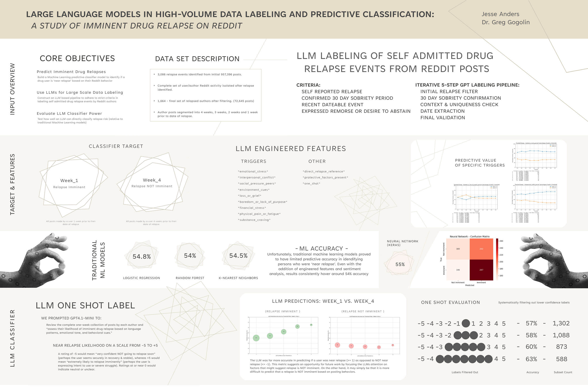

# LLMs for High-Volume Data Labeling & Predictive Classification

**A study of imminent drug-relapse signals on Reddit** — using large language models to build a research dataset that would otherwise have been impossible, then testing what can (and can't) be predicted from it.

Funded research fellowship, Ferris State University (2025). Co-authored with Dr. Greg Gogolin.
📄 **[Read the full paper](Anders_LLM_Relapse_Labeling_paper.pdf)** · poster below.

---

## The problem

Predicting relapse in substance-use recovery is a longstanding goal, and recovery communities on Reddit are full of relevant signal — but the data is unusable without labels. Confirming a single true relapse event (self-reported, after a real sobriety period, with a datable timeline) means reading long, messy, deeply personal posts one at a time. Prior work in this space labeled ~1,000 users and it took *four people four days*. Labeling at the scale needed here — nearly a million posts — would take an estimated **~20 person-years** of manual annotation. That bottleneck is why the research mostly doesn't get done.

## What I built

An **iterative LLM labeling pipeline** that compressed that ~20 person-years of annotation into **under 40 processor-hours**, then a full modeling and evaluation study on top of the dataset it produced.

**1 — LLM labeling pipeline (950k+ → 3,086 events).** Five successive GPT annotation passes over 957,396 posts, each tightening the criteria — initial relapse filter → 30-day-sobriety confirmation → context/uniqueness check → relapse-date extraction → full-model final validation. Prompts were tuned against human-reviewed sample sets with a "rationale-checked" step that surfaced systematic model errors (e.g. attributing a third party's relapse to the author) so the instructions could be corrected before each full run.

**2 — LLM feature engineering (~800k labels).** GPT then coded each of ~72,645 posts against 11 clinically-grounded relapse signals (emotional stress, interpersonal conflict, substance craving, protective factors, an explicit "direct relapse reference," and more), rolled up to per-week counts and percentages.

**3 — Modeling & evaluation.** Framed as a binary task — can posts from the week before a relapse be distinguished from posts a month out? Trained logistic regression, random forest, gradient boosting, SVM, k-NN, and a Keras neural net, with threshold sweeps, confusion matrices, balanced-vs-imbalanced splits, and random-seed sensitivity checks.

**4 — LLM as a direct predictor.** A final "one-shot" experiment: instead of hand-built features, ask the LLM directly to rate imminent-relapse likelihood from −5 to +5, then evaluate confidence-filtered subsets.

## What the results actually showed

| Approach | Result |
| --- | --- |
| Classical ML on 3 features (text, sentiment, word count) | Near chance — 48–52% |
| Classical ML on 13 LLM-engineered features | Marginally better, ~54%, but no real signal |
| **LLM direct "one-shot" prediction, high-confidence subset** | **Up to ~71% accuracy** (on the model's most confident predictions) |

The honest headline is a **null result** for classical ML: within a one-month window, aggregate Reddit behavior did not carry a reliable, generalizable signal of imminent relapse. That's a result worth reporting — it tempers a common assumption that people reliably "signal" before relapse, and it saves the next team the same dead end.

The more interesting finding: the **LLM used directly as a predictor** outperformed every classical model, reaching ~71% on its high-confidence calls — evidence that confidence-weighted LLM judgments can extract signal from language that hand-built features miss.

## Why this is the interesting part of my portfolio

- **Signal-from-noise at scale** in messy, high-volume behavioral text — the core of most applied ML in healthcare and claims.
- **LLM-as-labeler and LLM-as-predictor**, evaluated against classical baselines rather than assumed to win.
- **Measurement discipline** — human-in-the-loop prompt validation, redundancy culling, outlier handling, seed-sensitivity analysis, and reporting a null result honestly instead of overselling.
- **A healthcare / behavioral-health domain** handled with an explicit ethics stance.

## Ethics & data privacy

This work uses publicly available Reddit data on a sensitive topic, and it's handled accordingly. Per the study's ethics commitments, **all analysis is anonymized — no usernames and no verbatim user posts appear in the paper, the poster, or this repository.** The relapse dataset itself (raw posts, author identifiers) is **intentionally not published here** to protect the individuals in it. The paper also explicitly cautions against using methods like these for real-time flagging or intervention; they're for retrospective research and hypothesis generation only.

*See [`SCRUB_CHECK.md`](SCRUB_CHECK.md) for exactly what is and isn't included in this repo, and why.*

---

*Jesse Anders — [jesse@greenongreen.com](mailto:jesse@greenongreen.com)*
